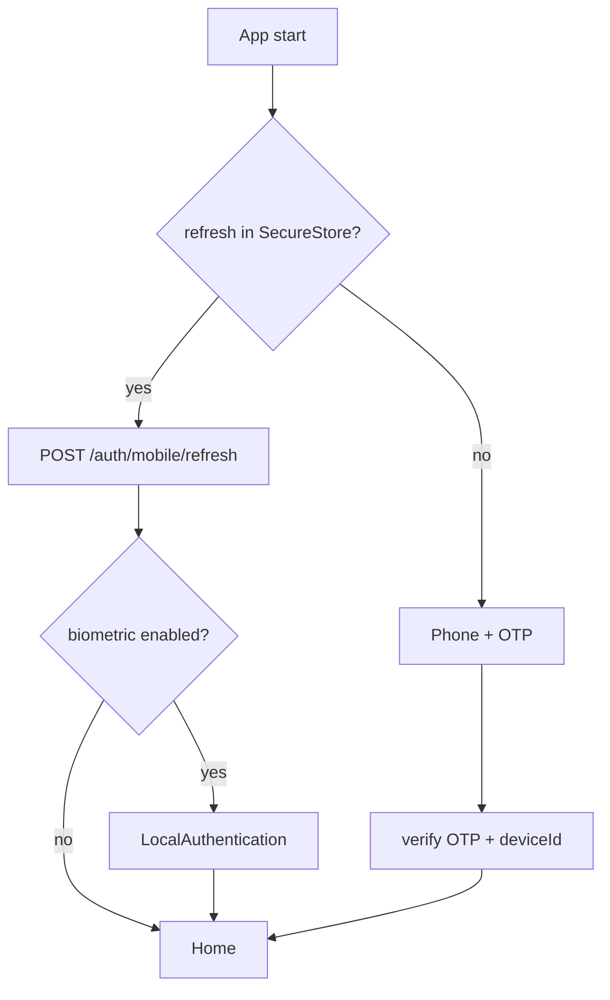

# GP Service — mobile authentication

Production-ready OTP + refresh session flow for **Expo** (`apps/gp-service-mobile`). Existing email/password API is unchanged.

## Stack

| Layer | Tech |
|-------|------|
| Client storage | `expo-secure-store` (access, refresh, deviceId) |
| Biometrics | `expo-local-authentication` (Face ID / fingerprint) |
| API | `POST /auth/mobile/*` + JWT access (15m) + refresh rotation (30d) |

## Quick test (2 minutes)

1. **API + DB**

```bash
cd /path/to/gp_project
npm install
npm run prisma:migrate:deploy
npm run prisma:generate
npm run dev:api
```

2. **Expo app** (simulator or phone on same Wi‑Fi)

```bash
npm run mobile:urls          # copy LAN IP
export EXPO_PUBLIC_API_URL=http://192.168.x.x:4000   # your IP
npm run dev:mobile
```

3. **Login**

- Enter phone `+77001234567`
- Channel SMS or WhatsApp
- Dev OTP: response field `devCode` or fixed `123456` if `MOBILE_OTP_FIXED=123456` in API env
- Enable biometric checkbox → next cold start shows Face ID gate

## Flow



- **First login:** phone → OTP → device bound → tokens saved.
- **Next launches:** silent refresh (one request) → optional biometric → home. No login screens if session valid.
- **Biometric:** client-only gate after refresh; server still validates refresh token + `deviceId`.

## API endpoints

| Method | Path | Auth |
|--------|------|------|
| POST | `/auth/mobile/otp/send` | — |
| POST | `/auth/mobile/otp/verify` | — |
| POST | `/auth/mobile/refresh` | — |
| POST | `/auth/mobile/logout` | — |
| POST | `/auth/mobile/logout-all` | Bearer |
| GET | `/auth/mobile/sessions` | Bearer |

## Env (API)

```env
MOBILE_OTP_FIXED=123456          # optional dev code
MOBILE_ACCESS_EXPIRES_IN=15m
MOBILE_REFRESH_DAYS=30

# WhatsApp OTP (gpartners-portal-api сияқты)
WHATSAPP_SERVICE_URL=https://wp.gpartners.kz/queues/push
WHATSAPP_SERVICE_TOKEN=          # Bearer token

# SMS (опционал)
OTP_WEBHOOK_URL=                 # POST { phone, code, channel: "sms" }

# Store review (prod verify-only)
# OTP_STORE_REVIEW_PHONE=+7...
# OTP_STORE_REVIEW_CODE=777777

# Dev bypass (verify-only, prod-та өшіріңіз)
# OTP_DEV_BYPASS_ENABLED=true
# OTP_DEV_BYPASS_CODE=777777
```

`POST /auth/mobile/otp/send` with `channel: "whatsapp"` returns `whatsappSent: true|false` when WhatsApp is used (best-effort; OTP is always stored server-side).

## Production deploy (GitHub)

Repository **Secrets**:

| Name | Description |
|------|-------------|
| `WHATSAPP_SERVICE_TOKEN` | Bearer token for `wp.gpartners.kz` queue (**required** for deploy) |

Repository **Variables** (optional):

| Name | Default |
|------|---------|
| `WHATSAPP_SERVICE_URL` | `https://wp.gpartners.kz/queues/push` |
| `OTP_STORE_REVIEW_PHONE` | — |
| `OTP_DEV_BYPASS_ENABLED` | `false` |

`OTP_STORE_REVIEW_CODE` — Secret if used.

Web apps (`gp-service`, `gp-partner`, `gp-admin`) use shared `WhatsappOtpLogin` — default channel WhatsApp on login screens.

## Бір телефон — бірнеше рөл

Бір `User` жазбасы, бір телефон:

- **Service** (`loginAs: client`) — `clientProfile` + JWT сессиясы `CLIENT`
- **Partner** (`loginAs: partner`) — `partnerProfile` қосылады + JWT `PARTNER`
- **Admin** (`loginAs: admin`) — тек бұрын берілген admin құқығы бар аккаунт (автоматты admin құрылмайды)

Бірінші кіруде жаңа user жасалады; кейін басқа фронтта кірсеңіз — сол user-ге қажет профиль қосылады.

## Security notes

- Refresh tokens stored hashed server-side; rotation on each refresh.
- `deviceId` required for refresh (device binding).
- `logout-all` revokes all refresh families for the user.
- Access token in SecureStore; never in AsyncStorage.

## Web GP Service

Web app keeps `POST /auth/login`. Mobile uses parallel `auth/mobile` routes only.
